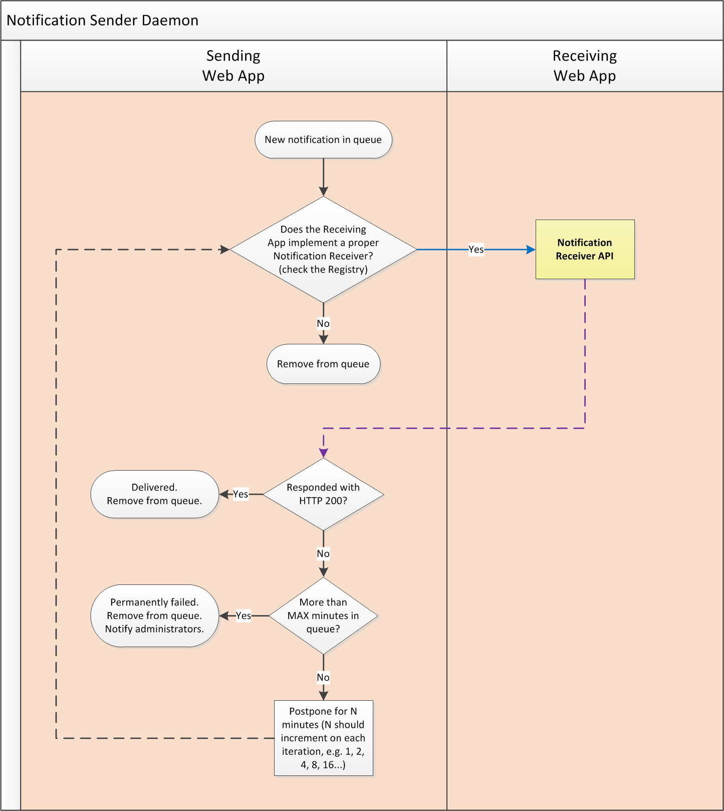

EWP Mobility Process Explained
==============================

* [What is the status of this document?][statuses]
* [See the index of all other EWP Specifications][develhub]

Summary
-------

With help of some flowcharts, this document briefly describes **how the Student
Mobility Business Process is modeled within the EWP Network**. It should be
useful to get a quick grasp on which APIs are used by whom and when.

Accessing information on Institutions
-------------------------------------

The following APIs allow the members of the EWP Network to discover basic
information on institutions and departments covered by other EWP Hosts. This
kind of information is also known as **fact sheets**.

 * **[Institutions API][institutions-api]** - e.g. address, contact persons,
   logo image, list of departments, perhaps also a list of academic terms used,
   etc. Among other things, it also may allow the clients to fetch
   **PDF Fact Sheets** (a "business card" in a nice, printable format,
   exchanged by IROs to help everyone with the mobility process).

 * **[Departments API][departments-api]** - detailed information on specific
   departments, e.g. address, contact persons, institutes or other kinds of
   subunits, etc.

**Note:** While these enable you discover more information on EWP Hosts, the
actual *index* of all EWP Hosts is provided by the [Registry Service]
[registry-intro]).

**Some examples of usage:**

 * An IRO staff member wants to obtain contact details of some other IRO.
 * Some automation script wants to obtain all email addresses of IRO members of
   a specific HEI and notify them after some important event occurs.
 * A student of one HEI wants to obtain a link to ECTS catalogue of some other
   HEI.
 * A developer wants to implement an autocomplete feature for searching
   departments in a foreign institution.

CNRs and Notification Senders
-----------------------------

CNR stands for **Change Notification Receiver**, and it is a special class of
API we use in EWP. We have already mentioned them in the [EWP Architecture]
[architecture] document, but now we should explain how they work in detail.

**CNR APIs are simply a callback URLs** for [push notifications]
(https://en.wikipedia.org/wiki/Push_technology):

 * Partners subscribe for such notifications by implementing a chosen CNR API
   (depending on the type of entity they would like to watch) and publishing it
   in their [manifest file][discovery-api].

 * Once this is done, the CNR URL should be triggered (by other EWP partners)
   whenever a related entity is updated. This allows the partners to keep fresh
   copies of data.

 * Of course, in order for this to work, the server responsible for the entity
   must be able to send such notifications (this ability is also published in
   the [manifest files][discovery-api]). It also should gracefully handle
   temporary I/O errors caused by, for example, a malfunction on the receiver's
   servers.

The following flowchart presents the basic flow of the process:

It must be noted, that - in practice - the notification sending process
described above **will never be flawless**. It is very probable that due to
some server or programming errors, some notifications will either fail to be
sent or fail to be received properly.

**Implementers SHOULD plan for such scenario.** E.g. if your copy of an entity
has not been updated from the entity-owner server in a while, then mark it as
*stale*, and fetch it directly from the server when you need to access it for
the next time. In some cases, you might also be able to use one of the *Search
APIs* to fetch the data you need (i.e. IDs of newly added, or recently changed
entities).

Handling Interinstitutional Agreements (IIAs)
---------------------------------------------

All HEIs taking part in the mobility process sign an IIA first. Key facts about
all such IIAs are stored in computer systems of all HEIs taking part of this
IIA. **You can use the following APIs to synchronize these facts.**

* **[Interinstitutional Agreements API][iias-api]**:

  - Implemented by each of the partners. (Not strictly required, but
    RECOMMENDED.)
  - `index` endpoint allows **HEI A** to access the list of all IIAs related to
    **HEI A** stored on **HEI B**'s servers.
  - `get` endpoint allows **HEI A** to access the content of an agreement
    (IIA), exactly as it is currently stored on **HEI B**'s servers (and this
    enables both HEIs to find inconsistencies more easily).

    

* **[Interinstitutional Agreement CNR API][iia-cnr-api]**

  - Implemented by each of the partners. (OPTIONAL.)
  - When implemented, it gets called whenever an IIA is updated on the other
    party's servers. This allows the partners to keep a close eye on all the
    changes to the IIA copies throughout the network. [What's a CNR?][cnr]

    

Outgoing Mobility object
------------------------

In EWP's model, entire history of a single student mobility is enclosed in so
called *Outgoing Mobility* object. This includes:

 * Information about the student, optional photo, the ID of the related IIA,
   identifiers of the sending and receiving institutions, etc.

 * Nomination dates: when they were initially reported, when they were
   approved, or even "un-approved", etc.

 * Learning Agreements: How they looked initially, when they were initially
   approved, how (and when) they were later changed, and by whom, and how
   they looked "in the end". (Learning Agreements are modified quite often,
   throughout the entire mobility.)

 * Recognitions: Which of the courses in the Learning Agreement were recognized
   by the sending institution after the mobility has ended.

 * Course identifiers, arrival/departure dates, and many more.

What's important to remember for now is that most of the mobility-related
actions performed in EWP can be thought as **adding a new entry to the Outgoing
Mobility timeline**.

It's also worth noting, that partners are not required to implement all
features of the mobility timeline. E.g. we allow the partners to implement
nominations only, while leaving Learning Agreements to be implemented later on
(see `<timeline-features-supported>` element in the [Outgoing Mobility Remote
Update API][mobility-update-api]'s `manifest-entry.xsd`).

Workflow in general
-------------------

All mobility-related features in EWP use a common set of APIs, and have a
similar workflow. This chapter introduces some basic concepts, which we will
later apply to specific use cases.

### `S-MASTER` vs. `R-MASTER`

There are two basic mobility workflows in use in computer systems today. Some
readers may find EWP's workflow quite natural, while others may say it's
"turned upside down". This is caused by the fact that - at the time of writing
this - half of Europe is using one approach, while the other half uses the
other.

 * First approach (let's call it `S-MASTER`), and the one we will use in EWP,
   is that the mobility history is **stored on the sending institution's
   servers**, and it is created and updated primarily by the sending
   institution. Such mobility history always describes an "outgoing mobility".

   Receiving institution may keep its own copy of the Mobility object, and it
   is allowed to update parts of it, but all such updates are indirect (the
   receiving institution needs to request the sending institution to make the
   change).

 * Second approach (`R-MASTER`) is that the mobility history is **stored on the
   receiving institution's servers**. You might say that in this case the
   mobility history describes an "incoming mobility".

   Coordinators from the sending institution are allowed to sign into the
   receiving institution's system and then they can create and update the
   Mobility object. Receiving institution is the "master" of the data, and it
   is the sending institution that has to ask to make a change.

It's also worth noting that:

 * Some institutions probably use a mixed approach. For example, they use
   `S-MASTER` for a subset of mobility properties, and `R-MASTER` for the rest,
   depending on which side seems to the more authoritative in regard of the
   particular property. It's important to emphasize that this mixed approach
   is still a [master/slave][master-slave] approach (as every property has a
   single master).

 * No institutions we know of chose a truly [multi-master][multi-master]
   approach (in which every change would be asynchronously propagated and
   all conflicts were automatically resolved).

It's important to note that both `S-MASTER` and `R-MASTER` approaches offer
exactly the same functionality. The only *functional difference* between them
is the problem of authority ("who has the final say?").

Unfortunately, the *technical differences* are bigger, and these are important
for us, developers. It *is* feasible to work with multiple approaches
simultaneously (and some of the readers probably already do), but is NOT
feasible to use two approaches for processing a *single* property of a *single*
Mobility object - that would require us to implement a multi-master approach,
and we have [decided](https://github.com/erasmus-without-paper/general-issues/issues/9)
against it. Therefore, for each single mobility, we should determine which
approach we will be using.

### Why we chose `S-MASTER` for EWP?

At first glance, it might seem reasonable that we should try to support both
approaches in EWP. However, if we give it a little more thought, it seems clear
that this would actually make EWP adoption *more* difficult than supporting
only *one* workflow:

 * If we require all EWP members to support multiple workflows, then *all*
   members will need to do additional work. Members who use `S-MASTER` flow
   would be required to implement the `R-MASTER` flow, and vice-versa.

 * If we require only one approach, then only *half* of the members are
   required to do this additional work.

We have picked `S-MASTER` approach for the *majority* of mobility properties in
EWPs workflow, and here's some reasoning behind this decision:

 * While it seems that existing computer systems in Europe are evenly divided
   between two approaches, the proportion for the *initial* EWP partners is
   quite different (most partners seem to be using `S-MASTER`). Since it is
   important to give the project a good kick start, we want to make it easier
   for the initial EWP partners to adopt it.

 * `S-MASTER` seems to also be a slightly better choice from the *functional*
   point of view. As we said above, the only functional difference between the
   two is the problem of authority. It seems that it is the *sending
   institution* which should be "in charge" of the greater part of mobility's
   properties (not necessarily all of them).

### General guidelines on migrating from other workflows

We recognize that many systems use other workflows than the one we chose for
EWP, and probably *all* partners will need at least *some* changes in their
workflows to support EWP. Having that in mind, we'll try to offer some basic
guidelines on the migration process, wherever we think some guidelines might be
needed.

In general, most partners will need to support both workflows, at least for
some time.

**If both HEIs support EWP workflow already:**

   * As was said before, it would be very difficult to support both workflows
     for a single mobility, so - at first - we advise to support EWP workflow
     for *new mobilities* only. If sending coordinators were allowed to create
     new nominations in the Receiving Web App, then they should be advised to
     not do that any longer - they should now create nominations in their own
     system (Sending Web App).

   * Once the new workflow between two HEIs is well adopted, you may decide to
     speed up the process and exchange all the mobilities between the two of
     you [`.ewpmobility` Exchange File][ewpmobility-file] might be of use
     here).

   * Once this is done, and all of your common mobilities are stored safely on
     the sending institution's servers and accessible via EWP - you may remove
     the sending coordinators' accounts from your Receiving Web App.

**If the other HEI does not support EWP workflow yet:**

   * You should continue with your current workflow (when exchanging students
     with this particular HEI).

   * You should implement all Mobility APIs, prepare your system for the EWP
     workflow, and wait for the other HEIs do so too.

You can even try to differentiate between these two scenarios *dynamically*
by monitoring the Registry's catalogue and checking if all EWP Mobility
Workflow APIs have been implemented by the other HEI. Once they are, you can -
for example - stop allowing the creation of new nominations on your side.

### Outgoing Mobility APIs

This is the set of APIs which the *sending institution* MUST implement in
order to support EWP mobility workflow:

 * **[Outgoing Mobilities API][mobilities-api]** -  allows the receiving
   institution to access Outgoing Mobility objects (by ID).

 * **[Outgoing Mobility Search API][mobility-search-api]** - allows the
   receiving institution to access the list of Mobility objects related to the
   receiving institution. It also provides an alternative way of getting
   updates if the sending institution fails to send updates to CNRs.

 * **[Outgoing Mobility Remote Update API][mobility-update-api]** - implemented
   by the *sending* institution, allows the receiving institution to update
   some properties of the *Outgoing Mobility* object.

   Note, that since the sending institution is the master of the Mobility
   object, then no change on it can be performed if the master doesn't allow
   for this change. This also means that no changes can be performed when the
   *Sending Web App* is unavailable for some reason. If implementers of the
   *Receiving Web App* want to allow their users to update things while the
   remote server is offline, then they might be required to implement a daemon
   (similar to the [Notification Sender daemon][notification-senders] described
   earlier).

Other related APIs and formats:

 * **[Outgoing Mobility CNR API][mobility-cnr-api]** - implemented by the
   *receiving* institution, allows it to receive live updates when the entity
   is changed (provided that the *sending* institution can send such updates).

 * **[`.ewpmobility` Exchange File][ewpmobility-file]** - this is not a web
   service. It's a file format, which can be exchanged by other means (such
   as email). It establishes a common format for exchanging mobility data, in a
   form strictly compatible with EWP Outgoing Mobility objects. Can be useful
   when moving mobility data from one institution to another (e.g. when
   migrating `R-MASTER`-based workflows to EWP workflow).

### Uniqueness of `mobility_ids`

We [need](https://github.com/erasmus-without-paper/general-issues/issues/10)
Outgoing Mobility identifiers to be unique within the entire EWP Network. In
order to guarantee this, we need to impose some requirements.

 * The identifiers SHOULD be generated by the *sending* institution (when a
   new nomination is first created, or a previously existing mobility is
   imported from other sources).

 * The identifiers MUST match the `[0-9a-f]{32}` regular expression (case
   sensitive, no dashes).

 * When generating new identifiers, implementers MUST use proper entropy to
   guarantee its uniqueness. The sending institution's SCHAC ID SHOULD be part
   of this entropy.

   You can achieve this effect in various ways, for example:

   * By hashing a concatenation of a random Version 4 UUID with your SCHAC ID.
   * By using a Version 5 UUID with a namespace derived from your SCHAC ID.

These guidelines maximize the probability that - if a collision occurs - it
will first occur in **your own** database (because your database is the only
database which contains all identifiers generated with your SCHAC ID
namespace). This in turn will cause an exception, thus limiting the probability
of the conflicting ID spreading outside.

Handling Nominations
--------------------

After IIA is signed, *sending institution* begins recruitment for the mobility.
As the result of the recruitment, students are nominated. The *receiving
institution* is then notified, and nominations are being approved (usually all
of them).

For each new nomination, the sending institution creates a new Outgoing
Mobility object. By reviewing this object's history (which is incorporated in
the Outgoing Mobility object itself) you get to know when nominations are
created, accepted or rejected. The receiving institution is notified about
creation of new objects and all updates to the existing ones (via the CNR API
we have described earlier).

The following flowchart illustrates how nomination process works in EWPs
workflow (this is the workflow we require every member to support):

Preparing Learning Agreements
-----------------------------

After nominations are accepted, students prepare their Learning Agreements
(LAs). It might seem as a completely separate process from the user's
perspective but internally, adding new courses to the Learning Agreement is
implemented the same way as accepting and rejecting nominations is - by adding
new history entries to the same Outgoing Mobility object (and by using the same
APIs).

*Sidenote: Remember, that servers are allowed to implement a subset of mobility
history entries. Information on the implemented features is published via the
Registry Service.*

It's worth noting that the **receiving institution is also allowed to edit
Learning Agreements** in EWP. The flowchart below presents only one of the
possible use cases in which it is the student who edits his own LA, but LAs can
also be edited by both coordinators if need be. All changes, regardless of who
made them, need to be accepted by all three parties (the student, the sending
coordinator, and the receiving coordinator). You can read more on this subject
in [Outgoing Mobility Remote Update API][mobility-update-api] and [Outgoing
Mobilities API] [mobilities-api].

As we said, the primary workflow uses APIs which we have already introduced.
There are however some other APIs which might be useful during this stage:

 * **[Courses API][courses-api]** -  implemented by the *receiving*
   institution, it allows to verify if a course by the given ID exists, and -
   in some cases - if it has been confirmed that it will be conducted during
   the next academic term.

   Please note, that implementing Courses API is **optional** in the EWP
   Mobility process - Learning Agreements *can* be filled out without the
   receiving institution implementing it. However, it is still RECOMMENDED
   for the receiving institution to implement it, because it allows for a much
   better user experience when Learning Agreements are edited in the sending
   institution's web application (and we want students to be able to edit them
   there).

 * **[Course Search API][course-search-api]** - implemented by the *receiving*
   institution, it allows the sending institution to search through the remote
   catalogue of courses.

   As above, implementing this API is **optional**, but RECOMMENDED. It allows
   the sending institution to design for a better user experience.

The following flowchart presents the entire process:

Approving Learning Agreements
-----------------------------

At some point, the student wants his LA to be approved. To do so, he first
approves it himself, then waits for other actors to approve it. As with the
editing, the approval process can also be started by other actors (e.g. the
receiving coordinator). Regardless of who starts the process, the LA is
approved when three "approved" entries are recorded in a row. At this moment LA
gets "approved by all parties".

Learning Agreements can still be edited after they are approved. Then, they can
be approved again. Each such change is recorded, and all actors can review each
of these changes.

There are no new APIs needed for approving LAs. We will be using only the ones
we have described earlier. The following flowchart presents the entire process:

Exchanging Arrival and Departure dates
--------------------------------------

After the mobility ends, the *sending* institution usually needs to know the
exact dates on which the student has arrived to and departed from the
receiving institution (this is related to the final value of the stipend
provided for the student). The *receiving* coordinator is required to provide
this data.

Again, we will use the **Outgoing Mobility Remote Update API** for this
purpose. Arrival and departure dates are properties of the mobility, and each
change of such properties is recorded in mobility's history.

Exchanging Transcripts of Records (ToRs)
----------------------------------------

Currently:

 * EWP allows for ToRs to be transferred from the receiving institution to the
   sending institution. This is usually done after the mobility ends.

 * EWP does not specify any means to transfer ToRs the other way around (from
   the sending institution to the receiving). We will [revisit this subject]
   (https://github.com/erasmus-without-paper/ewp-specs-mobility-flowcharts/issues/2)
   however, if it turns out that many partners would like to make use of it.

We will focus on the first of these two for the rest of this chapter.

We have decided to *not* make ToRs part of the Outgoing Mobility object, but
they are still tightly connected (for example, we encourage all editors to try
to enter all proper course identifiers in Learning Agreement so that they match
with course identifiers encountered in the Transcript of Records).

The exchange of the Transcripts of Records can be initiated in multiple ways:

 * By the student, who should be allowed to click a button in his Sending Web
   App, which in turn would refresh the Transcript of Records. The student
   should also be able to mark his mobility as "ready for recognition" at this
   point.

 * By the receiving coordinator, who is allowed to update the Outgoing Mobility
   object by adding a new history entry saying that the mobility is now ready
   to be recognized.

 * The sending coordinator is in charge of the recognition process so he should
   also always be able to review a fresh ToR. Depending on the exact
   recognition workflow used in the sending HEI, he may also be able to start
   the recognition process without waiting for the student (nor the receiving
   coordinator), even when the mobility is not yet marked as "ready".

One new API is used in this process:

 * **[Transcripts of Records API][tors-api]** - implemented by the receiving
   institution, it allows the sending institution to retrieve transcript of
   records of their students.

The following flowchart presents all of the scenarios:

Recognition
-----------

The exact workflow of the recognition process is not in scope of EWP. However,
it's worth noting that the Outgoing Mobility object provides some basic
information on this topic too.

Please review the [Outgoing Mobilities API specification][mobilities-api] for
details.

[registry-intro]: https://github.com/erasmus-without-paper/ewp-specs-architecture/blob/stable-v1/README.md#registry
[develhub]: http://developers.erasmuswithoutpaper.eu/
[statuses]: https://github.com/erasmus-without-paper/ewp-specs-management/blob/stable-v1/README.md#statuses
[architecture]: https://github.com/erasmus-without-paper/ewp-specs-architecture
[discovery-api]: https://github.com/erasmus-without-paper/ewp-specs-api-discovery
[notification-senders]: https://github.com/erasmus-without-paper/ewp-specs-mobility-flowcharts#notification-senders
[cnr]: https://github.com/erasmus-without-paper/ewp-specs-mobility-flowcharts#notification-senders
[institutions-api]: https://github.com/erasmus-without-paper/ewp-specs-api-institutions
[departments-api]: https://github.com/erasmus-without-paper/ewp-specs-api-departments
[iias-api]: https://github.com/erasmus-without-paper/ewp-specs-api-iias
[iia-cnr-api]: https://github.com/erasmus-without-paper/ewp-specs-api-iia-cnr
[iia-search-api]: https://github.com/erasmus-without-paper/ewp-specs-api-iia-search
[master-slave]: https://en.wikipedia.org/wiki/Master/slave_(technology)
[multi-master]: https://en.wikipedia.org/wiki/Multi-master_replication
[mobilities-api]: https://github.com/erasmus-without-paper/ewp-specs-api-mobilities
[mobility-update-api]: https://github.com/erasmus-without-paper/ewp-specs-api-mobility-update
[mobility-search-api]: https://github.com/erasmus-without-paper/ewp-specs-api-mobility-search
[mobility-cnr-api]: https://github.com/erasmus-without-paper/ewp-specs-api-mobility-cnr
[ewpmobility-file]: https://github.com/erasmus-without-paper/ewp-specs-fileext-ewpmobility
[tors-api]: https://github.com/erasmus-without-paper/ewp-specs-api-tors
[courses-api]: https://github.com/erasmus-without-paper/ewp-specs-api-courses
[course-search-api]: https://github.com/erasmus-without-paper/ewp-specs-api-course-search
