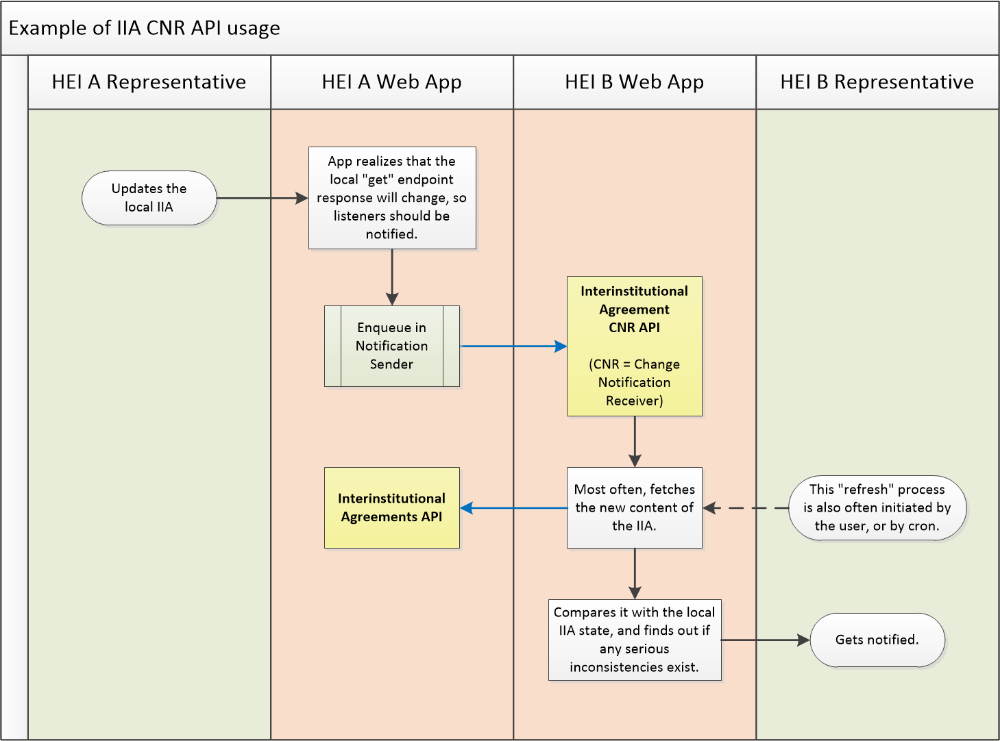
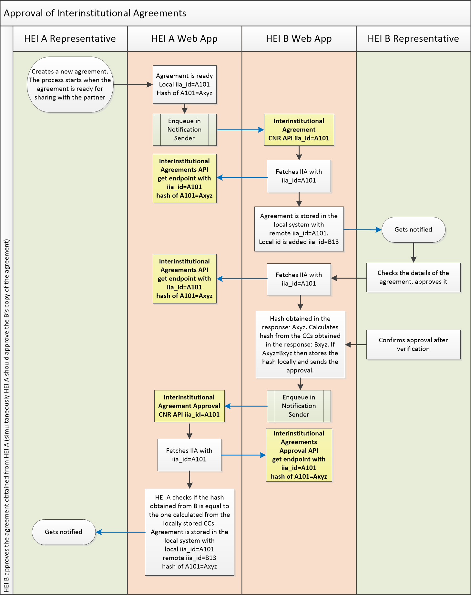
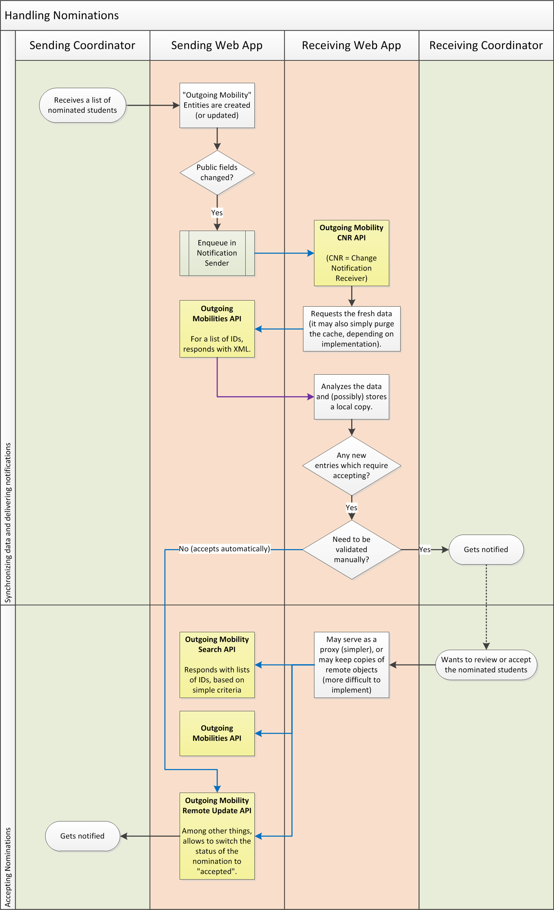
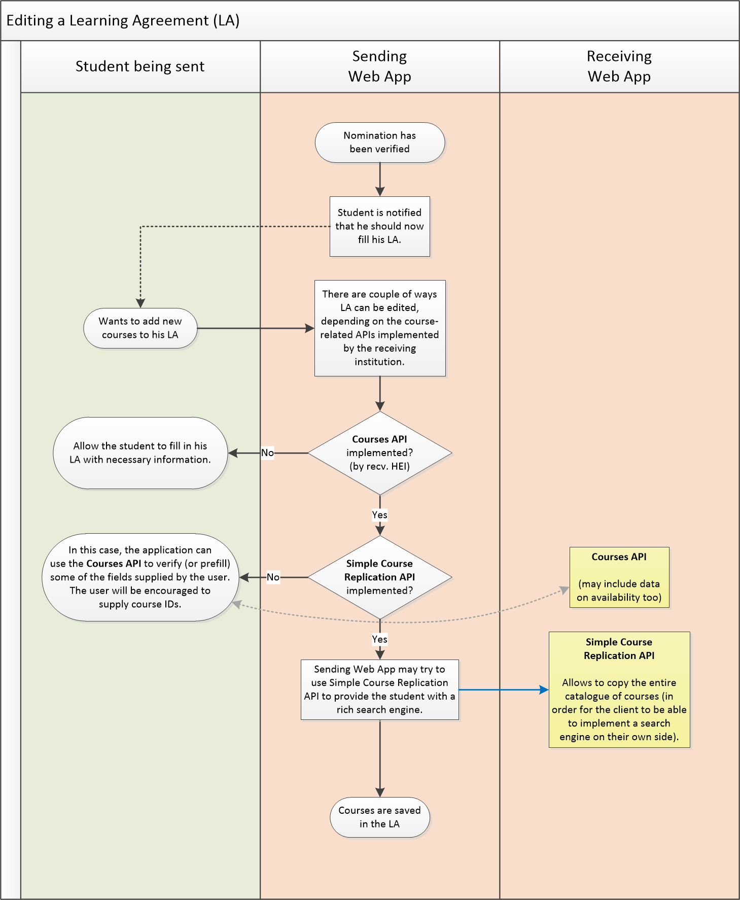
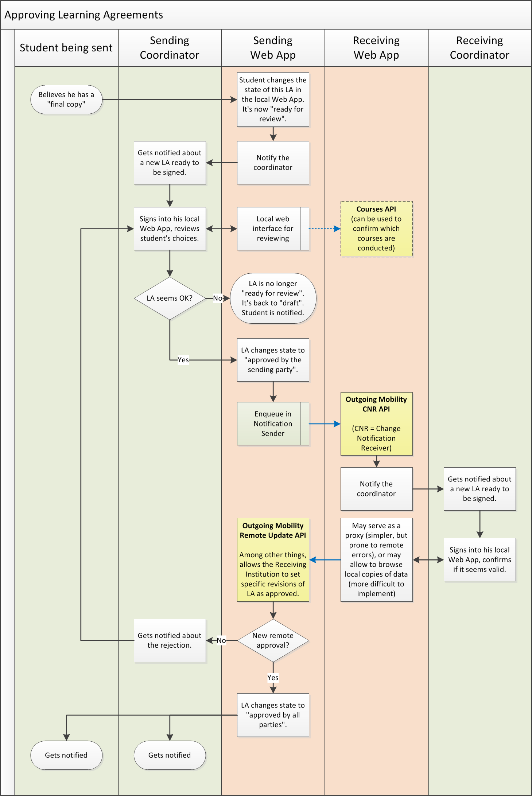
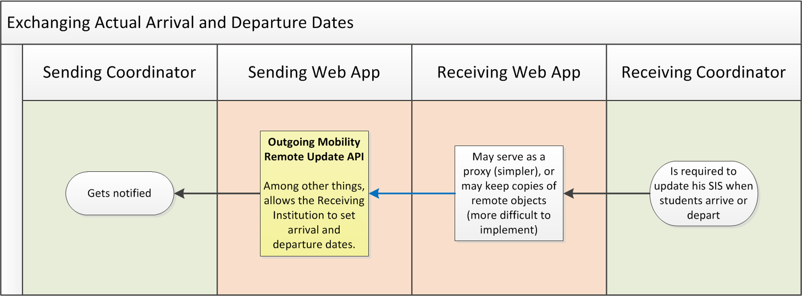
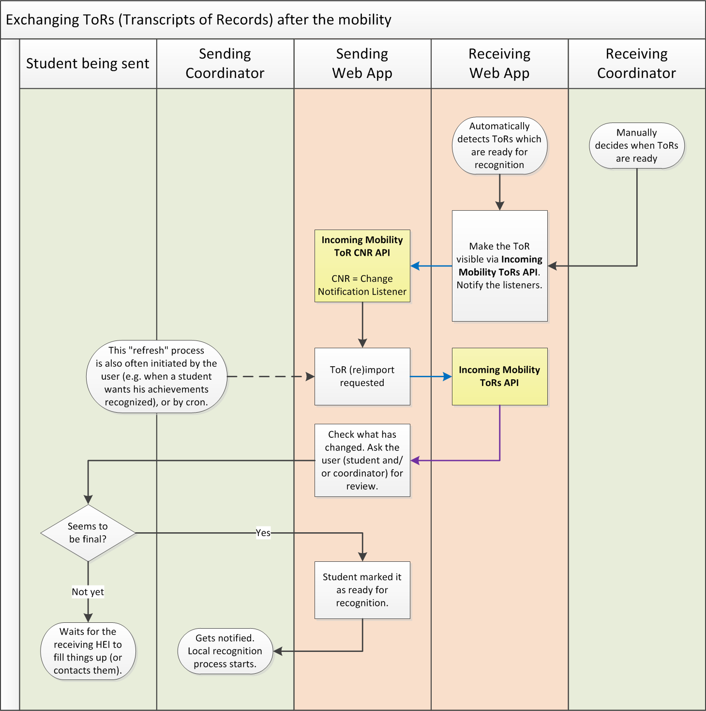

EWP Mobility Process Explained
==============================

* [What is the status of this document?][statuses]
* [See the index of all other EWP Specifications][develhub]

Summary
-------

With the help of some flowcharts, this document briefly describes **how the Student
Mobility Business Process is modeled within the EWP Network**. It should be
useful to get a quick grasp on which APIs are used by whom and when.

Is it up to date?
-----------------

Before reading this document, check its last-modified date, and compare
it to the respective dates of the API specifications. If particular EWP APIs still haven't
been marked as stable, they MAY change substantially. For this reason, this
document MAY fall behind. While reading this document, keep in mind that some
fresh versions of the APIs might not work *exactly* as they have been explained
here.

A note for future maintainers of this document:
remember to update the description and diagrams after any backward incompatible changes in the APIs have been made.

Accessing information on Institutions
-------------------------------------

The following APIs allow the members of the EWP Network to discover basic
information on institutions and organizational units covered by other EWP
partners.

 * **[Institutions API][institutions-api]** - provides information about the
   HEI, e.g. its address, contact persons, logo image, list of organizational units, etc.

 * **[Organizational Units API][ounits-api]** - provides very similar types of
   information as the Institutions API does, but on the department/faculty
   level. Quite often, organizational units will have a tree structure, with
   the HEI in the root of that tree.

Some basic examples of when these APIs might be used:

 * When developers want to display the details of a HEI referenced by its ID in
   other APIs,
 * When an IRO staff member wants to obtain contact details on other IROs,
 * When a HEI wants to make information, such as links to ECTS catalogues of other HEIs, available for students,
 * When a developer wants to implement an autocomplete feature for searching
   through the organizational units of foreign institutions.
 * etc.

IROs also exchange so-called fact sheets about their institutions - "business cards" in a nice, printable format.
The documents should contain all information the incoming student should know.
Fact sheets may be exchanged in the EWP network in two ways:

 * Institutions API and Organizational Units API provide a link to a current version of a fact sheet
   (in HTML or PDF format), stored in the information system of the institution.
   The partner HEI can obtain such a link and display it for their students in the local system.
   Each institution should keep its fact sheets up to date.
 * Mobility Factsheet API delivers a fact sheet in a structured form compliant with the IIA template,
   prepared by the European Commission, defining requirements for Interinstitutional Agreements.
   In this case, the partner HEI is responsible for obtaining the latest version of the fact sheet via API
   on demand and displaying its content in the local system.

Handling Interinstitutional Agreements (IIAs)
---------------------------------------------

All HEIs taking part in the mobility process sign IIAs with each other.
According to requirements of the EC, these agreements have to be processed via the EWP network, fully electronically.
Signed paper versions are neither needed nor recommended.

The following APIs can be used to exchange details of IIAs:

* **[Interinstitutional Agreements API][iias-api]** is implemented by IIA
  partner HEIs. None of these HEIs is the "master" of the IIA, all HEIs are
  "equal". HEI A can access all IIAs related to HEI A stored on HEI B's servers.
  Each partner uses his own ID for the IIA, so partners will need to manually "bind"
  their local agreements with their remote counterparts (by storing the remote partners' IIA IDs)
  before they will be able to compare them. HEIs can negotiate details of the agreement outside EWP
  or using IIA API and IIA CNR API. These APIs enable HEIs to find possible inconsistencies in their IIAs
  and synchronize them.

* **[Interinstitutional Agreement CNR API][iia-cnr-api]** allows HEIs to get
  notified whenever any IIA (related to them) is updated on the other HEI's
  servers.

IIAs need not be formally signed with qualified electronic signatures.
However, HEIs need an official partner's approval of their IIA copies.
The approval process is supported by two other APIs:

 * **[Interinstitutional Agreements Approval API][iias-approval]** is used to approve agreements sent by their partners
   in the Interinstitutional Agreements API. If HEI B wants to approve agreements obtained from HEI A
   (more precisely: partner's copy of the agreements) should send HEI’s A `iia_id`s
   of the approved agreements in this API.
 * **[Interinstitutional Agreement Approval CNR API allows HEIs][iia-approval-cnr]** to get notified whenever
   any IIA approval (related to them) is updated on the other HEI's servers.

HEI B, by sending `iia_id` obtained from HEI A, approves the agreement identified by this `iia_id`.
However, HEI B needs proof that HEI A has not changed the agreement after HEI B has last seen it.
To reference and approve a particular version of the partner’s agreement,
HEIs attach to each agreement a digest (hash) of the agreement.

HEI B MUST verify this digest before sending the approval notification (via the IIA Approval CNR API).
For this purpose, HEI B has to call the IIAs get API and compare the hash received in the response
with the hash independently calculated from the received response.
If both hashes are identical, the agreement can be approved.
The approval API carries two values - `iia_id` and hash.
Hash MUST NOT be calculated from the local copy of the agreement.

Each partner should behave in the same way and independently:

 * Get partner’s copy of the agreement, check the hash,
   send notification about an approval of this version to the partner and store the partner hash and response as the proof;
 * Get the partner's approval to its own copy and store the response (`iia_id` and hash)
   locally as the proof that the partner has approved a particular version of the agreement;

Partner HEIs can also (optionally) exchange PDF versions of the agreement, in IIAs Approval API.

The detailed example scenario of using IIA API and IIA Approval API with the corresponding CNRs is available in the example scenario folder.

The following flowcharts illustrate some of the possible scenarios:

It is also possible that one HEI enters details of the agreement to the local system and the other downloads it to its own system.

Student Mobilities
------------------

### Outgoing and Incoming Mobility APIs

Each mobility can be looked at from two different perspectives:

 * The **outgoing** perspective - this is how the mobility looks like for the
   **sending HEI**.
 * The **incoming** perspective - this is how the mobility looks like for the
   **receiving HEI**.
 * Your own incoming mobility is your partner's outgoing one.

In EWP, the **sending HEI** is the **master** of the majority of the student
mobility data. The receiving HEI often keeps its own "slave" copy of this
mobility data, but it is the sending HEI who is actually *required* to have it
recorded.

In the [master/slave][master-slave] communication model, it is always the
master who has the most up-to-date copy of the data. The master is not required
to pull the changes from the slave. It's the slave's responsibility to push
changes at the master. This means that:

 * The [Outgoing Mobilities API][omobilities-api] is used for serving
   information which we (EWP designers) chose the sending HEI to be the master
   of. If the receiving HEI wants to change some of this data, it needs to
   "ask" (e.g. via a phone call, or - if applicable - via an API call).

 * Similarly, the [Incoming Mobilities API][imobilities-api] is used for
   serving information which the receiving HEI is the master of (and the
   sending HEI needs to "ask" to change it).

The non-master partners still "have a say", but they might need to work a bit
harder for their "say" to "get committed". For example, if the changes are
proposed via an `update` endpoint, and the sending HEI's servers are
offline, then they cannot store these proposals.

There are also the CNR APIs, similar to the ones described in the previous
sections:

 * **[Outgoing Mobility CNR API][omobility-cnr-api]** and
   **[Outgoing Mobility Learning Agreement CNR API][omobility-la-cnr-api]** are implemented by the
   *receiving* institution, and allows it to receive live updates when
   outgoing mobilities are changed. Partners SHOULD NOT rely on always receiving
   these notifications. Please read [CNR introduction][cnr] to understand why.

 * Similarly, **[Incoming Mobility CNR API][imobility-cnr-api]** and
   **[Incoming Mobility ToRs CNR API][imobility-tor-cnr-api]** are implemented
   by the *sending* HEI, and gets called by the *receiving* HEI when their own
   "master part" of the mobility gets updated.

### Alternative file exchange format

There's also the **[`.ewpmobility` Exchange File][ewpmobility-file]**. This is
not a web service. It is a file format, which can be exchanged by other means
(such as email). It establishes a common format for exchanging mobility data,
in a form strictly compatible with EWP Outgoing Mobility objects. Can be useful
when moving mobility data from one institution to another (e.g. when migrating
from other workflows to the EWP workflow).

Handling Nominations
--------------------

After IIA is signed, *sending institution* begins recruitment for mobility.
As a result of the recruitment, students are nominated. The *receiving
institution* is then notified, and nominations are being approved (usually all
of them).

For each new nomination, the sending institution creates a new Outgoing
Mobility object. The receiving institution is
notified (via the CNR API we have briefly described earlier) about (a) creation
of new Outgoing Mobility objects, and (b) all updates to the existing Outgoing
Mobility objects.

The following flowchart illustrates how a nomination process works in EWPs
workflow. More scenarios can be found in [Outgoing Mobilities API workflows][omobilities-api-workflows].

Preparing Learning Agreements
-----------------------------

After nominations get verified by the receiving partner, students prepare their
Learning Agreements (LAs).
This is a separate process in the user's interface, and internally it is covered by other APIs.

All changes to the LA need to be accepted by all three parties
(the student, the sending coordinator, and the receiving coordinator).

The primary workflow uses the following APIs:

 * **[Outgoing Mobility Learning Agreements API][omobility-las-api]** - implemented by the sending HEI.
   It allows the receiving HEI to read and accept Learning Agreements,
   stored on the sending HEI's servers and approved by a student and the sending HEI, and propose changes to them.
   This API is based on the new LA template. The most recent version is available [here][iia-la-template].
 * **[Outgoing Mobility Learning Agreement CNR API][omobility-la-cnr-api]** - implemented by the receiving HEI,
   allows partner institutions to send notifications whenever learning agreements
   kept on the partner institutions' servers are changed.

There are, however, some other APIs that might be useful during this stage:

 * **[Courses API][courses-api]** - implemented by the *receiving*
   institution, it allows verifying if a course by the given ID exists, and -
   in some cases - if it has been confirmed that it will be conducted during
   the next academic term.

   Please note, that implementing Courses API is **optional** in the EWP
   Mobility process - Learning Agreements *can* be filled out without the
   receiving institution implementing it. However, it is still RECOMMENDED
   for the receiving institution to implement it. It allows for a much
   better user experience when Learning Agreements are edited in the sending
   institution's web application (and we want students to be able to edit them
   there).

 * **[Simple Course Replication API][course-replication-api]** - implemented by
   any HEI, it allows other HEIs to copy the entire Course Catalogue.

   As above, implementing this API is **optional**, but RECOMMENDED. It allows
   the sending institution to design for a better user experience.

There are many example scenarios related to LAs -
see [Outgoing Mobility Learning Agreements API scenarios][omobility-la-scenarios] and
[OLA Dashboard use cases and scenarios][omobility-la-ola-scenarios].

The following flowchart presents the entire process:

Approving Learning Agreements
-----------------------------

At some point, the student wants their LA to be approved. To do so, the student first
approves it themselves, then waits for other actors to approve it.
The next would come approval from the sending HEI, and finally approval from the receiving HEI.

The LA is approved only after all three
parties approve it. The details of this process are explained in the API specs.

Learning Agreements can still be edited by the student in the system of the sending HEI
after they are approved. Then, they can
be approved again, and again. Sending institutions are encouraged to keep a record of all
such changes for audit purposes.
Currently, the European Commission does not require the entire history of changes
to be made available to the receiving institution. If such a request is made by the EC,
the appropriate EWP API will be defined.

There are no new APIs needed for approving LAs. We will be using only the ones
we have described earlier. The following flowchart presents the entire process:

Exchanging Arrival and Departure dates
--------------------------------------

After the mobility ends, the *sending* institution usually needs to know the
exact dates on which the student has arrived to - and departed from - the
receiving institution (this is related to the final value of the stipend
provided for the student). The *receiving* coordinator is required to provide
this data.

In this case - it is the receiving HEI who is the "master" of this date.
Therefore, it is published by the receiving HEI via its Incoming Mobilities
API.

Exchanging Transcripts of Records (ToRs)
----------------------------------------

Currently:

 * EWP allows for ToRs to be transferred from the receiving institution to the
   sending institution. This is usually done after the mobility ends.

 * EWP does not specify any means to transfer ToRs the other way around (from
   the sending institution to the receiving one), nor to transfer ToRs to
   partners which we didn't sign IIAs with. There are some talks about adding
   these features though. For example, see
   [here](https://github.com/erasmus-without-paper/ewp-specs-mobility-flowcharts/issues/2)
   or [here](https://github.com/erasmus-without-paper/general-issues/issues/28).

At this moment, there are two API used in the ToR exchange process:

 * **[Incoming Mobility ToRs API][imobility-tors-api]** - implemented by the
   receiving institution, it allows the sending institution to retrieve
   transcript of records of their students.

 * **[Incoming Mobility ToR CNR API][imobility-tor-cnr-api]** - implemented by
   the sending institution, it allows it to get notified by the receiving HEI
   when ToRs are changed.

The following flowchart presents a possible usage scenario:

It's worth noting that the exact workflow of the **recognition process** is not
in scope of EWP. However, the Outgoing Mobility object provides some basic
information on this topic too. Please review the [Outgoing Mobilities API
specification][omobilities-api] for details.

Migrating from other workflows
------------------------------

As you can see after reading the sections above, all mobility-related features
in EWP use a common set of APIs, and have a similar workflow. This chapter
discusses the reasons we have picked such a workflow, and compares it to
**other workflows** you might be more familiar with.

### `S-MASTER` and `R-MASTER` approaches

We found two basic mobility workflows in use in computer systems today. Some
readers may find EWP's workflow quite natural, while others may say it's
"turned upside down". This is caused by the fact that at the time of writing
this half of Europe seems to be using one approach, while the other half uses
the other.

The **S-MASTER and R-MASTER definitions** introduced here are not "official" in
any way. We made them up. We simply wanted to have some kind of a label for
them to refer to. (If you want to reuse these terms somewhere else, then you
can use [this permalink][sr-master-definitions] to refer others here.)

 * First approach, and the one we will use in EWP (let's call it `S-MASTER`),
   is that the mobility history is **stored on the sending institution's
   servers**, and it is created and updated primarily by the sending
   institution (hence the "S" in the code-name). Such mobility history always
   describes an "outgoing mobility".

   Receiving institution may keep its own copy of the Mobility object, and it
   is allowed to update parts of it, but all such updates are indirect (the
   receiving institution needs to request the sending institution to make the
   change).

 * Second approach (`R-MASTER`) is that the mobility history is **stored on the
   receiving institution's servers**. You might say that in this case the
   mobility history describes an "incoming mobility" (as opposed to "outgoing"
   one).

   Coordinators from the sending institution are allowed to sign into the
   receiving institution's system and then they can create and update the
   mobility data. Receiving institution is the "master" of the data, and it
   is the sending institution that has to "ask" to make a change.

It's also worth noting that:

 * Some institutions probably use a mixed approach. For example, they use
   `S-MASTER` for a subset of mobility properties, and `R-MASTER` for the rest,
   depending on which side seems to the more authoritative in regard of the
   particular property. It's important to emphasize that this mixed approach
   is still a [master/slave][master-slave] approach (as every property has a
   single master).

 * No institutions we know of chose a truly [multi-master][multi-master]
   approach (in which every change would be asynchronously propagated and
   all conflicts were automatically resolved).

Both `S-MASTER` and `R-MASTER` approaches offer exactly the same functionality.
The only **functional difference** between them is the problem of authority
("who has the final say?").

Unfortunately, the **technical differences** are bigger, and these are
important for us, developers. It *is* feasible to work with multiple approaches
simultaneously (and some of the readers probably already do), but is NOT
feasible to use two approaches for processing a *single* property of a *single*
Mobility object - that would require us to implement a multi-master approach,
and [we have decided](https://github.com/erasmus-without-paper/general-issues/issues/9)
against it. Therefore, for each single mobility, we must determine which
approach we will be using.

### Why we chose `S-MASTER` for EWP?

At first glance, it might seem reasonable that we should try to support both
approaches in EWP. However, if we give it a little more thought, it seems clear
that this would actually make EWP adoption *more* difficult than supporting
only *one* workflow:

 * If we require all EWP members to support multiple workflows, then *all*
   members will need to do additional work. Members who use `S-MASTER` flow
   would be required to implement the `R-MASTER` flow, and vice-versa.

 * If we require only one approach, then only *half* of the members are
   required to do this additional work.

We have picked `S-MASTER` approach for the *majority* of mobility properties in
EWPs workflow, and here's some reasoning behind this decision:

 * While it seems that existing computer systems in Europe are evenly divided
   between two approaches, the proportion for the *initial* EWP partners is
   quite different (most partners seem to be using `S-MASTER`). Since it is
   important to give the project a good kick start, we want to make it easier
   for the initial EWP partners to adopt it.

 * `S-MASTER` seems to also be a slightly better choice from the *functional*
   point of view. As we said above, the only functional difference between the
   two is the problem of authority. And it seems that it is the *sending
   institution* which SHOULD be "in charge" of the greater part of mobility's
   properties (though not necessarily all of them).

### General guidelines on migrating from `R-MASTER` workflows

We recognize that many systems use other workflows than the one we chose for
EWP, and probably *all* partners will need at least *some* changes in their
workflows to support EWP. Having that in mind, we'll try to offer some basic
guidelines on the migration process (not only here, but throughout all API
specifications).

In general, we believe that initially most partners will need to support both
workflows for some time (their current one, and the new one, introduced by
EWP). The choice on which of the workflows to use for particular mobility
depends on the answer to the following question: **Does the partner institution
(also) support EWP workflow?**

**If both HEIs support EWP workflow already:**

   * As was said before, it would be very difficult to support both workflows
     for a single mobility, so - at first - we advise to support EWP workflow
     for *new mobilities* only. If sending coordinators were allowed to create
     new nominations in the Receiving Web App, then they should be advised to
     not do that any longer - they should now create nominations in their own
     system (Sending Web App).

   * Once the new workflow between two HEIs is well adopted, you may decide to
     speed up the process and exchange all the mobilities between the two of
     you ([`.ewpmobility` Exchange File][ewpmobility-file] might be of use
     here).

**If the other HEI does not support EWP workflow yet:**

   * You should continue with your current workflow (when exchanging students
     with this particular HEI).

   * You should implement all Mobility APIs, prepare your system for the EWP
     workflow, and wait for the other HEIs do so too.

You can even try to differentiate between these two scenarios *dynamically*
by monitoring the Registry's catalogue and checking if all EWP Mobility
Workflow APIs have been implemented by the other HEI. Once they are, you can -
for example - stop allowing the creation of new nominations on your side.

<!-- Self links -->
[sr-master-definitions]: https://github.com/erasmus-without-paper/ewp-specs-mobility-flowcharts#common-workflow

<!-- Architecture links -->
[registry-intro]: https://github.com/erasmus-without-paper/ewp-specs-architecture/blob/stable-v1/README.md#registry
[develhub]: http://developers.erasmuswithoutpaper.eu/
[statuses]: https://github.com/erasmus-without-paper/ewp-specs-management/blob/stable-v1/README.md#statuses
[architecture]: https://github.com/erasmus-without-paper/ewp-specs-architecture
[notification-senders]: https://github.com/erasmus-without-paper/ewp-specs-mobility-flowcharts#notification-senders
[cnr]: https://github.com/erasmus-without-paper/ewp-specs-architecture#cnr

<!-- API links -->
[discovery-api]: https://github.com/erasmus-without-paper/ewp-specs-api-discovery
[echo-api]: https://github.com/erasmus-without-paper/ewp-specs-api-echo
[registry-api]: https://github.com/erasmus-without-paper/ewp-specs-api-registry
[institutions-api]: https://github.com/erasmus-without-paper/ewp-specs-api-institutions
[ounits-api]: https://github.com/erasmus-without-paper/ewp-specs-api-ounits
[courses-api]: https://github.com/erasmus-without-paper/ewp-specs-api-courses
[course-replication-api]: https://github.com/erasmus-without-paper/ewp-specs-api-course-replication
[iias-api]: https://github.com/erasmus-without-paper/ewp-specs-api-iias
[iia-cnr-api]: https://github.com/erasmus-without-paper/ewp-specs-api-iia-cnr
[omobilities-api]: https://github.com/erasmus-without-paper/ewp-specs-api-omobilities
[omobility-cnr-api]: https://github.com/erasmus-without-paper/ewp-specs-api-omobility-cnr
[omobility-las-api]: https://github.com/erasmus-without-paper/ewp-specs-api-omobility-las
[omobility-la-cnr-api]: https://github.com/erasmus-without-paper/ewp-specs-api-omobility-la-cnr
[imobilities-api]: https://github.com/erasmus-without-paper/ewp-specs-api-imobilities
[imobility-cnr-api]: https://github.com/erasmus-without-paper/ewp-specs-api-imobility-cnr
[imobility-tors-api]: https://github.com/erasmus-without-paper/ewp-specs-api-imobility-tors
[imobility-tor-cnr-api]: https://github.com/erasmus-without-paper/ewp-specs-api-imobility-tor-cnr
[iias-approval]: https://github.com/erasmus-without-paper/ewp-specs-api-iias-approval
[iia-approval-cnr]: https://github.com/erasmus-without-paper/ewp-specs-api-iia-approval-cnr

<!-- Other specs links -->
[ewpmobility-file]: https://github.com/erasmus-without-paper/ewp-specs-fileext-ewpmobility
[iia-la-template]: https://github.com/erasmus-without-paper/ewp-specs-api-iias/blob/stable-v7/resources/template_EuropeanCommission_IIA_21-29.pdf
[omobilities-api-workflows]: https://github.com/erasmus-without-paper/ewp-specs-api-omobilities/tree/v1.0.0#workflows-of-changes-in-nomination-and-departure-statuses
[omobility-la-scenarios]: https://github.com/erasmus-without-paper/ewp-specs-api-omobility-las/tree/v1.0.1/examples/example-scenario
[omobility-la-ola-scenarios]: https://github.com/erasmus-without-paper/ewp-specs-api-omobility-las/blob/v1.0.1/examples/ola-dashboard-example-scenarios/EDDSI_OLA_Dashboard_use_cases_and_scenarios.pdf

<!-- External links -->
[master-slave]: https://en.wikipedia.org/wiki/Master/slave_(technology)
[multi-master]: https://en.wikipedia.org/wiki/Multi-master_replication
