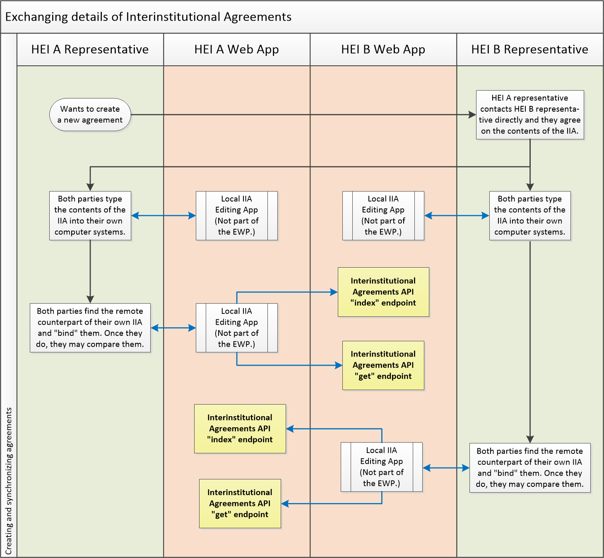
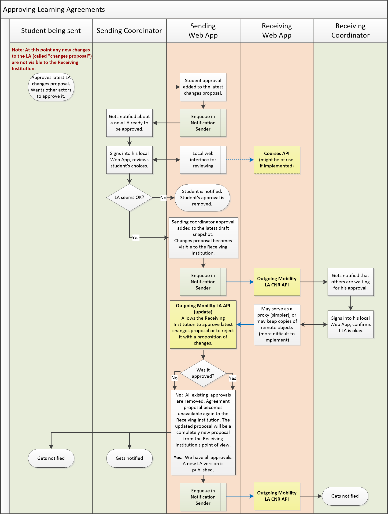
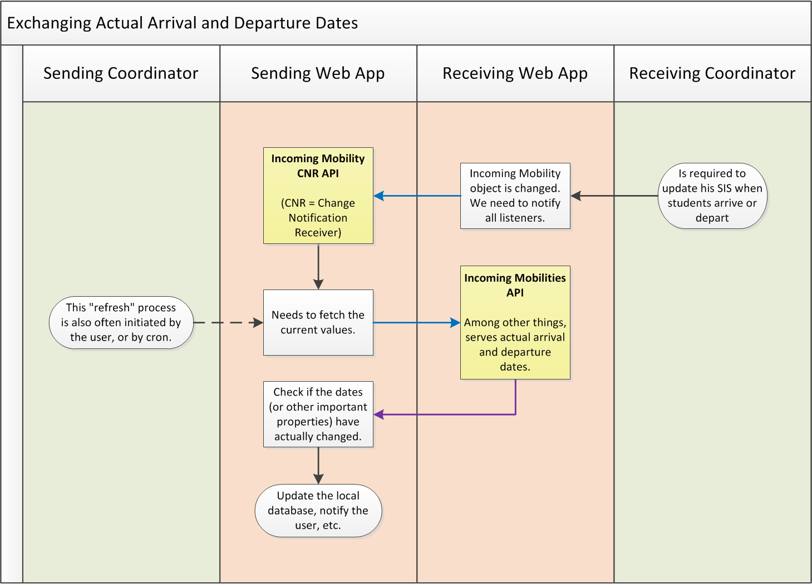

EWP Mobility Process Explained
==============================

* [What is the status of this document?][statuses]
* [See the index of all other EWP Specifications][develhub]

Summary
-------

With help of some flowcharts, this document briefly describes **how the Student
Mobility Business Process is modeled within the EWP Network**. It should be
useful to get a quick grasp on which APIs are used by whom and when.

Is it up-to-date?
-----------------

Before reading this document, take care of its last-modified date, and compare
it to respective dates of the API specifications. Many EWP APIs still hadn't
been marked as stable, and MAY change substantially. For this reason, this
document MAY fall behind. While reading this document, keep in mind that some
fresh versions of the APIs might not work *exactly* as they have been explained
here.

A note for future maintainers of this document: Once all mobility-related APIs
become stable, this document SHOULD be updated. From this point forwards, all
changes to the APIs should be backward-compatible, so that this document
wouldn't require frequent updating.

Accessing information on Institutions
-------------------------------------

The following APIs allow the members of the EWP Network to discover basic
information on institutions and organizational units covered by other EWP
partners. (This kind of information is also referred to as "fact sheets".)

 * **[Institutions API][institutions-api]** - provides information about the
   HEI, e.g. its address, contact persons, logo image, list of organizational
   units, etc. One of the more interesting features is the ability to provide a
   link to a current version of a **PDF Fact Sheet** - a "business card" in a
   nice, printable format, exchanged by IROs to help everyone with the mobility
   process.

 * **[Organizational Units API][ounits-api]** - provides very similar types of
   information as the Institutions API does, but on the department/faculty
   level. Quite often, organizational units will have a tree structure, with
   the HEI in the root of that tree.

Some basic examples of when these API might be used:

 * When developers want to display the details of a HEI referenced by its ID in
   other APIs.
 * When an IRO staff member wants to obtain contact details on other IROs.
 * When a student of one HEI wants to obtain links to ECTS catalogues of other
   HEIs.
 * When a developer wants to implement an autocomplete feature for searching
   through the organizational units of foreign institutions.
 * etc.

Handling Interinstitutional Agreements (IIAs)
---------------------------------------------

All HEIs taking part in the mobility process sign IIAs with each other first.
The signing itself doesn't (currently) occur via EWP, but EWP can be used to
exchange data on both signed and not-yet-signed IIAs.

* **[Interinstitutional Agreements API][iias-api]** is implemented by IIA
  partner HEIs. None of these HEIs is the "master" of the IIA, all HEIs are
  "equal". This API allows **HEI A** to access all IIAs **related to** HEI A
  stored on **HEI B**'s servers.

* **[Interinstitutional Agreement CNR API][iia-cnr-api]** allows HEIs to get
  notified whenever any IIA (related to them) is updated on the other HEI's
  servers. (Partners SHOULD NOT rely on always receiving this notification
  though. Please read [CNR introduction][cnr] to understand why.)

These APIs enable HEIs to find possible inconsistencies in their IIAs more
easily, and synchronize them. Each partner uses his own ID for the IIA, so
partners will need to manually "bind" their local agreements with their remote
counterparts (by storing the remote partners' IIA IDs) before they will be able
to compare them. A partner is also allowed to peek on draft IIA proposals
published by the other partner without actually storing them on his own server.

Student Mobilities
------------------

### Outgoing and Incoming Mobility APIs

Each mobility can be looked at from two different perspectives:

 * The **outgoing** perspective - this is how the mobility looks like for the
   **sending HEI**.
 * The **incoming** perspective - this is how the mobility looks like for the
   **receiving HEI**.
 * Obviously, your own incoming mobility is your partner's outgoing one.

In EWP, the **sending HEI** is the **master** of the majority of the student
mobility data. The receiving HEI often keeps its own "slave" copy of this
mobility data, but it is the sending HEI who is actually *required* to have it
recorded.

In the [master/slave][master-slave] communication model, it is always the
master who has the most up-to-date copy of the data. The master is not required
to pull the changes from the slave, it's the slave's responsibility to push
changes at the master. This means that:

 * The [Outgoing Mobilities API][omobilities-api] is used for serving
   information which we (EWP designers) chose the sending HEI to be the master
   of. If the receiving HEI wants to change some of this data, it needs to
   "ask" (e.g. via an phone call, or - if applicable - via an API call).

 * Similarly, the [Incoming Mobilities API][imobilities-api] is used for
   serving information which the receiving HEI is the master of (and the
   sending HEI news to "ask" to change that).

The non-master partners still "have a say", but they might need to work a bit
harder for their "say" to "get committed". For example, if the changes are
performed via an `update`-like endpoint, and the sending HEI's servers are
offline, then they cannot perform these changes (but they can retry later, or
temporarily fall back to sending email messages asking the partner to to change
things).

The are also the CNR APIs, similar to the ones described in previous sections:

 * **[Outgoing Mobility CNR API][omobility-cnr-api]** is implemented by the
   *receiving* institution, and allows it to receive live updates when
   outgoing mobilities are changed (provided that the *sending* institution is
   willing to send such updates). Partners SHOULD NOT rely on always receiving
   these notifications. Please read [CNR introduction][cnr] to understand why.

 * Similarly, **[Incoming Mobility CNR API][imobility-cnr-api]** is implemented
   by the *sending* HEI, and gets called by the *receiving* HEI when their own
   "master part" of the mobility gets updated.

### Alternative file exchange format

There's also the **[`.ewpmobility` Exchange File][ewpmobility-file]**. This is
not a web service. It is a file format, which can be exchanged by other means
(such as email). It establishes a common format for exchanging mobility data,
in a form strictly compatible with EWP Outgoing Mobility objects. Can be useful
when moving mobility data from one institution to another (e.g. when migrating
from other workflows to the EWP workflow).

Handling Nominations
--------------------

After IIA is signed, *sending institution* begins recruitment for the mobility.
As the result of the recruitment, students are nominated. The *receiving
institution* is then notified, and nominations are being approved (usually all
of them).

For each new nomination, the sending institution creates a new Outgoing
Mobility object with the `nomination` status. The receiving institution is
notified (via the CNR API we have briefly described earlier) about (a) creation
of new Outgoing Mobility objects, and (b) all updates to the existing Outgoing
Mobility objects.

The following flowchart illustrates how nomination process works in EWPs
workflow:

Preparing Learning Agreements
-----------------------------

After nominations get verified by the receiving partner, students prepare their
Learning Agreements (LAs). While this might be displayed as a completely
separate process in the user's interface, internally this is covered by the
same APIs.

*Sidenote: Remember, that in many cases servers are allowed to implement only
a subset of API features (e.g. only nominations, but not LAs). This differs
from API to API, and you should consult the specs for details.*

It's worth noting that the receiving institution MAY also be allowed to edit
Learning Agreements in EWP. The flowchart below presents only one of the
possible use cases in which it is the student who edits his own LA, but - if
both partners support this feature - then it is also possible for LAs to be
edited by both coordinators (via their own local user interfaces). All changes,
regardless of who made them, need to be accepted by all three parties (the
student, the sending coordinator, and the receiving coordinator).

As we said, the primary workflow uses APIs which we have already introduced.
There are however some other APIs which might be useful during this stage:

 * **[Courses API][courses-api]** -  implemented by the *receiving*
   institution, it allows to verify if a course by the given ID exists, and -
   in some cases - if it has been confirmed that it will be conducted during
   the next academic term.

   Please note, that implementing Courses API is **optional** in the EWP
   Mobility process - Learning Agreements *can* be filled out without the
   receiving institution implementing it. However, it is still RECOMMENDED
   for the receiving institution to implement it, because it allows for a much
   better user experience when Learning Agreements are edited in the sending
   institution's web application (and we want students to be able to edit them
   there).

 * **[Simple Course Replication API][course-replication-api]** - implemented by
   the any institution, it allows other institutions to copy the entire Course
   Catalogue.

   As above, implementing this API is **optional**, but RECOMMENDED. It allows
   the sending institution to design for a better user experience.

The following flowchart presents the entire process:

Approving Learning Agreements
-----------------------------

At some point, the student wants his LA to be approved. To do so, he first
approves it himself, then waits for other actors to approve it. As with the
editing, the approval process can also be started by other actors (e.g. the
receiving coordinator, when he wants to exchange a particular LA component to
a different one).

Regardless of who starts the process, the LA is approved only after all three
parties approve it. The details of this process are explained in the API specs.

Learning Agreements can still be edited after they are approved. Then, they can
be approved again, and again. Partners are encouraged to keep a record of all
such changes (European Commission requires mobility partners to keep only the
two snapshots - before and after mobility - but it seems safer to keep all
changes, for forward compatibility).

There are no new APIs needed for approving LAs. We will be using only the ones
we have described earlier. The following flowchart presents the entire process:

Exchanging Arrival and Departure dates
--------------------------------------

After the mobility ends, the *sending* institution usually needs to know the
exact dates on which the student has arrived to - and departed from - the
receiving institution (this is related to the final value of the stipend
provided for the student). The *receiving* coordinator is required to provide
this data.

In this case - it is the receiving HEI who is the "master" of this date.
Therefore, it is published by the receiving HEI via its Incoming Mobilities
API.

Exchanging Transcripts of Records (ToRs)
----------------------------------------

Currently:

 * EWP allows for ToRs to be transferred from the receiving institution to the
   sending institution. This is usually done after the mobility ends.

 * EWP does not specify any means to transfer ToRs the other way around (from
   the sending institution to the receiving one), nor to transfer ToRs to
   partners which we didn't sign IIAs with. There are some talks about adding
   these features though. For example, see
   [here](https://github.com/erasmus-without-paper/ewp-specs-mobility-flowcharts/issues/2)
   or [here](https://github.com/erasmus-without-paper/general-issues/issues/28).

These issues are still "live", and the following APIs and flowcharts might
quickly fall out of date. At this moment, there are two API used in the ToR
exchange process:

 * **[Incoming Mobility ToRs API][imobility-tors-api]** - implemented by the
   receiving institution, it allows the sending institution to retrieve
   transcript of records of their students.

 * **[Incoming Mobility ToR CNR API][imobility-tor-cnr-api]** - implemented by
   the sending institution, it allows it to get notified by the receiving HEI
   when ToRs are changed.

The following flowchart presents a possible usage scenario:

It's worth noting that the exact workflow of the **recognition process** is not
in scope of EWP. However, the Outgoing Mobility object provides some basic
information on this topic too. Please review the [Outgoing Mobilities API
specification][omobilities-api] for details.

Migrating from other workflows
------------------------------

As you can see after reading the sections above, all mobility-related features
in EWP use a common set of APIs, and have a similar workflow. This chapter
discusses the reasons we have picked such a workflow, and compares it to
**other workflows** you might be more familiar with.

### `S-MASTER` and `R-MASTER` approaches

We found two basic mobility workflows in use in computer systems today. Some
readers may find EWP's workflow quite natural, while others may say it's
"turned upside down". This is caused by the fact that at the time of writing
this half of Europe seems to be using one approach, while the other half uses
the other.

The **S-MASTER and R-MASTER definitions** introduced here are not "official" in
any way. We made them up. We simply wanted to have some kind of a label for
them to refer to. (If you want to reuse these terms somewhere else, then you
can use [this permalink][sr-master-definitions] to refer others here.)

 * First approach, and the one we will use in EWP (let's call it `S-MASTER`),
   is that the mobility history is **stored on the sending institution's
   servers**, and it is created and updated primarily by the sending
   institution (hence the "S" in the code-name). Such mobility history always
   describes an "outgoing mobility".

   Receiving institution may keep its own copy of the Mobility object, and it
   is allowed to update parts of it, but all such updates are indirect (the
   receiving institution needs to request the sending institution to make the
   change).

 * Second approach (`R-MASTER`) is that the mobility history is **stored on the
   receiving institution's servers**. You might say that in this case the
   mobility history describes an "incoming mobility" (as opposed to "outgoing"
   one).

   Coordinators from the sending institution are allowed to sign into the
   receiving institution's system and then they can create and update the
   mobility data. Receiving institution is the "master" of the data, and it
   is the sending institution that has to "ask" to make a change.

It's also worth noting that:

 * Some institutions probably use a mixed approach. For example, they use
   `S-MASTER` for a subset of mobility properties, and `R-MASTER` for the rest,
   depending on which side seems to the more authoritative in regard of the
   particular property. It's important to emphasize that this mixed approach
   is still a [master/slave][master-slave] approach (as every property has a
   single master).

 * No institutions we know of chose a truly [multi-master][multi-master]
   approach (in which every change would be asynchronously propagated and
   all conflicts were automatically resolved).

Both `S-MASTER` and `R-MASTER` approaches offer exactly the same functionality.
The only **functional difference** between them is the problem of authority
("who has the final say?").

Unfortunately, the **technical differences** are bigger, and these are
important for us, developers. It *is* feasible to work with multiple approaches
simultaneously (and some of the readers probably already do), but is NOT
feasible to use two approaches for processing a *single* property of a *single*
Mobility object - that would require us to implement a multi-master approach,
and [we have decided](https://github.com/erasmus-without-paper/general-issues/issues/9)
against it. Therefore, for each single mobility, we must determine which
approach we will be using.

### Why we chose `S-MASTER` for EWP?

At first glance, it might seem reasonable that we should try to support both
approaches in EWP. However, if we give it a little more thought, it seems clear
that this would actually make EWP adoption *more* difficult than supporting
only *one* workflow:

 * If we require all EWP members to support multiple workflows, then *all*
   members will need to do additional work. Members who use `S-MASTER` flow
   would be required to implement the `R-MASTER` flow, and vice-versa.

 * If we require only one approach, then only *half* of the members are
   required to do this additional work.

We have picked `S-MASTER` approach for the *majority* of mobility properties in
EWPs workflow, and here's some reasoning behind this decision:

 * While it seems that existing computer systems in Europe are evenly divided
   between two approaches, the proportion for the *initial* EWP partners is
   quite different (most partners seem to be using `S-MASTER`). Since it is
   important to give the project a good kick start, we want to make it easier
   for the initial EWP partners to adopt it.

 * `S-MASTER` seems to also be a slightly better choice from the *functional*
   point of view. As we said above, the only functional difference between the
   two is the problem of authority. And it seems that it is the *sending
   institution* which SHOULD be "in charge" of the greater part of mobility's
   properties (though not necessarily all of them).

### General guidelines on migrating from `R-MASTER` workflows

We recognize that many systems use other workflows than the one we chose for
EWP, and probably *all* partners will need at least *some* changes in their
workflows to support EWP. Having that in mind, we'll try to offer some basic
guidelines on the migration process (not only here, but throughout all API
specifications).

In general, we believe that initially most partners will need to support both
workflows for some time (their current one, and the new one, introduced by
EWP). The choice on which of the workflows to use for particular mobility
depends on the answer to the following question: **Does the partner institution
(also) support EWP workflow?**

**If both HEIs support EWP workflow already:**

   * As was said before, it would be very difficult to support both workflows
     for a single mobility, so - at first - we advise to support EWP workflow
     for *new mobilities* only. If sending coordinators were allowed to create
     new nominations in the Receiving Web App, then they should be advised to
     not do that any longer - they should now create nominations in their own
     system (Sending Web App).

   * Once the new workflow between two HEIs is well adopted, you may decide to
     speed up the process and exchange all the mobilities between the two of
     you ([`.ewpmobility` Exchange File][ewpmobility-file] might be of use
     here).

**If the other HEI does not support EWP workflow yet:**

   * You should continue with your current workflow (when exchanging students
     with this particular HEI).

   * You should implement all Mobility APIs, prepare your system for the EWP
     workflow, and wait for the other HEIs do so too.

You can even try to differentiate between these two scenarios *dynamically*
by monitoring the Registry's catalogue and checking if all EWP Mobility
Workflow APIs have been implemented by the other HEI. Once they are, you can -
for example - stop allowing the creation of new nominations on your side.

<!-- Self links -->
[sr-master-definitions]: https://github.com/erasmus-without-paper/ewp-specs-mobility-flowcharts#common-workflow

<!-- Architecture links -->
[registry-intro]: https://github.com/erasmus-without-paper/ewp-specs-architecture/blob/stable-v1/README.md#registry
[develhub]: http://developers.erasmuswithoutpaper.eu/
[statuses]: https://github.com/erasmus-without-paper/ewp-specs-management/blob/stable-v1/README.md#statuses
[architecture]: https://github.com/erasmus-without-paper/ewp-specs-architecture
[notification-senders]: https://github.com/erasmus-without-paper/ewp-specs-mobility-flowcharts#notification-senders
[cnr]: https://github.com/erasmus-without-paper/ewp-specs-architecture#cnr

<!-- API links -->
[discovery-api]: https://github.com/erasmus-without-paper/ewp-specs-api-discovery
[echo-api]: https://github.com/erasmus-without-paper/ewp-specs-api-echo
[registry-api]: https://github.com/erasmus-without-paper/ewp-specs-api-registry
[institutions-api]: https://github.com/erasmus-without-paper/ewp-specs-api-institutions
[ounits-api]: https://github.com/erasmus-without-paper/ewp-specs-api-ounits
[courses-api]: https://github.com/erasmus-without-paper/ewp-specs-api-courses
[course-replication-api]: https://github.com/erasmus-without-paper/ewp-specs-api-course-replication
[iias-api]: https://github.com/erasmus-without-paper/ewp-specs-api-iias
[iia-cnr-api]: https://github.com/erasmus-without-paper/ewp-specs-api-iia-cnr
[omobilities-api]: https://github.com/erasmus-without-paper/ewp-specs-api-omobilities
[omobility-cnr-api]: https://github.com/erasmus-without-paper/ewp-specs-api-omobility-cnr
[imobilities-api]: https://github.com/erasmus-without-paper/ewp-specs-api-imobilities
[imobility-cnr-api]: https://github.com/erasmus-without-paper/ewp-specs-api-imobility-cnr
[imobility-tors-api]: https://github.com/erasmus-without-paper/ewp-specs-api-imobility-tors
[imobility-tor-cnr-api]: https://github.com/erasmus-without-paper/ewp-specs-api-imobility-tor-cnr

<!-- Other specs links -->
[ewpmobility-file]: https://github.com/erasmus-without-paper/ewp-specs-fileext-ewpmobility

<!-- External links -->
[master-slave]: https://en.wikipedia.org/wiki/Master/slave_(technology)
[multi-master]: https://en.wikipedia.org/wiki/Multi-master_replication
