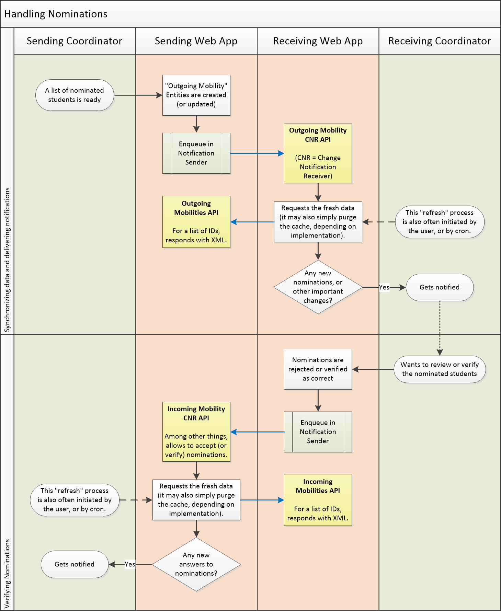

EWP Mobility Process Explained
==============================

* [What is the status of this document?][statuses]
* [See the index of all other EWP Specifications][develhub]

Summary
-------

With help of some flowcharts, this document briefly describes **how the Student
Mobility Business Process is modelled within the EWP Network**. It should be
useful to get a quick grasp on which APIs are used by whom and when.

Accessing information on Institutions
-------------------------------------

These three APIs allow the members of the EWP Network to discover basic
information on other institutions and departments covered by the network:

 * **Institutions API** - e.g. address, contact persons, logo image, list of
   primary departments, etc.

 * **Departments API** - detailed information on specific departments, e.g.
   address, contact persons, subdepartments, etc.

 * **PDF Fact Sheets API** - allows easier access to PDF versions of *Fact
   Sheet* documents (leaflet-like business cards exchanged by IROs to help
   everyone with the mobility process).

CNRs and Notification Senders
-----------------------------

CNR stands for **Change Notification Receiver**, and it is a special class of
APIs we use in EWP. We have already mentioned them in the [EWP Architecture]
[architecture] document, but now we should explain how they work in detail.

CNR is simply a callback URL for [push notifications]
(https://en.wikipedia.org/wiki/Push_technology):

 * Partners subscribe for such notifications by implementing a chosen CNR API
   (depending on the type of entity they would like to watch) and publishing it
   in their [manifest file][discovery-api].

 * Once this is done, the CNR URL should be triggered whenever a related entity
   is updated. This allows the partners to keep fresh copies of data.

 * Of course, in order for this to work, the server responsible for the entity
   must be able to send such notifications. It also should gracefully handle
   temporary I/O errors caused by, for example, a malfunction on the receiver's
   servers.

The following flowchart presents this process:

It must be noted, that - in practice - the notification sending process
described above **will never be flawless**. It is very probable that due to
some server or programming errors, some notifications will either fail to be
sent or fail to be received properly.

**Implementers SHOULD plan for such scenario.** E.g. if your copy of an entity
has not been updated from the entity-owner server in a while, then mark it as
*stale*, and fetch it directly from the server when you need to access it for
the next time. In some cases, you might also be able to use one of the *Search
APIs* to fetch the data you need (i.e. IDs of newly added, or recently changed
entities).

Handling Interinstitutional Mobility Agreements (IMAs)
------------------------------------------------------

All HEIs taking part in the mobility process must sign an IMA first.

Without the EWP Network, after the paper copy of the agreement is
signed, some parts of it might have been saved in the local computer systems,
but there was no central registry of such agreements. Without one, conflicts
were a possibility.

In order use EWP Network in your mobility process, key facts about all IMAs
MUST be saved to a central EWP repository, which will keep track of all the
changes and provide the latest copy of the agreement to all of the partners.

Once the partner agrees to keep all of his IMAs in the EWP repository, he will
be able to fetch their contents into their local computer systems automatically,
with help of the three APIs implemented by this repository:

* **Interinstitutional Mobility Agreements API** - implemented by the IMA
  Repository, use* by all the institutions. Allows to access the exact
  contents of an agreement (IMA) by a given ID.

* **Interinstitutional Mobility Agreements Search API** - implemented by the
  IMA Repository, used by all the institutions. Allows partners to fetch a
  list of all of their agreements stored in the repository.

* **Interinstitutional Mobility Agreements CNR API** - implemented by
  *institutions*, called by the *IMA Repository* (reversed!). CNR stands for
  "Change Notification Receiver". It's simply a callback URL for push
  notifications. When implemented, it gets called whenever an IMA is updated.
  This allows the partners to always have an up-to-date copy.

The following flowchart presents the entire process:

Handling Nominations
--------------------

After IMA is signed, *sending institution* begins recruitment for the mobility.
As the result of the recruitment, students are nominated. The list of
nominees is sent to the *receiving institution*, and nominations are approved
(usually all of them).

EWP model introduces a concept of **Outgoing Mobility Entity**:

 * This entity is stored on *sending institution's* servers. The receiving
   institution may keep a copy of it, but the sending institution's copy is
   always considered the primary one.

 * It describes a single mobility of a single student - starting from the
   nomination, and ending with the recognition.

 * Of course, not all nominations end with recognitions, some of the
   nominations are not even approved by the receiving party. The Outgoing
   Mobility entity contains status flags which allow us to differentiate
   between all these states.

During the exchanging and approving of the nominations the following new APIs
are used:

 * **Outgoing Mobilities API** - implemented by the *sending* institution,
   allows the receiving institution to access a given Outgoing Mobility entity
   (this includes information such as the name of the student, the ID of the
   related IMA, etc.).

 * **Outgoing Mobility CNR API** - implemented by the *receiving* institution,
   allows it to receive live updates when the entity is changed (provided that
   the *sending* institution can send such updates).

 * **Outgoing Mobility Search API** - implemented by the *sending* institution,
   allows the receiving institution to access the list Outgoing Mobilities
   bound to the receiving institution. It also provides an alternative way of
   getting updates if the sending institution cannot send updates to CNRs.

 * **Outgoing Mobility Remote Update API** - implemented by the *sending*
   institution, allows the receiving institution to update portions of the
   *Outgoing Mobility Entity*. Among other things, it allows to **approve
   nominations**.

   Note, that this API requires for all such changes to be made in an explicit
   way. This implies that the change cannot be performed if, for some reason,
   the *Sending Web App* is unavailable. If implementers of the *Receiving Web
   App* want to allow their users to update things while the remote server is
   offline, then they might be required to implement a daemon (similar to the
   [Notification Sender daemon][notification-senders] described earlier).

The following flowchart presents the entire process:

Preparing Learning Agreements
-----------------------------

After nominations as accepted, students prepare their Learning Agreements
(LAs). One of the things they will need to provide is the list of courses
picked from the Course Catalogue hosted by the *receiving* institution.

LA is stored and edited in the *Sending Web App*, but remote EWP APIs may ease
the process somewhat:

 * **Courses API** - implemented by the *receiving* institution, it allows to
   verify if a course by the given ID exists, and - in some cases - if it was
   confirmed that it will be conducted during the next academic term.

 * **Course Picker API** - **disputable** (may be dropped in the final revision
   of this document), implemented by the *receiving* institution, it allows the
   sending institution to redirect the student to the remote Course Catalogue,
   and search and select courses directly from it.

 * **Course Search API** - **disputable** (may be dropped in the final revision
   of this document), implemented by the *receiving* institution, it allows the
   sending institution to implement various classes of a local course catalogue
   browser (the student never leaves the *Sending Web App* in this case).

 * The *receiving* institution can be notified on all changes in the LA if
   it implements the proper CNR API (which we have already described in the
   previous section). These notifications seem unimportant at this point, but
   they will be, once LA is approved by both parties (see next chapter).

The following flowchart presents the entire process:

Approving Learning Agreements
-----------------------------

At some point, the students marks his LA as *ready for approval*. LA gets
verified by his local (sending) coordinator, and - once this is done - it also
needs to be approved by the *receiving* coordinator.

There are no *new* APIs we need to introduce at this point. We will be using
only the ones we have described earlier. The following flowchart presents the
entire process:

It's worth noting, that approved LAs can still be edited, and new revisions
will also need to be re-approved. The *Outgoing Mobility Entity* keeps a
history of all LA changes and approvals. Consult **Outgoing Mobilities API**
specification for details.

Exchanging Arrival and Departure dates
--------------------------------------

After the mobility ends, the *sending* institution usually needs to know the
exact dates on which the student has arrived to and departed from the
receiving institution (this is related to the final value of the stipend
provided for the student). The *receiving* coordinator is required to provide
this data.

Again, we will use the **Outgoing Mobility Remote Update API** for this
purpose (we have described this API earlier):

Exchanging Transcripts of Records (ToRs)
----------------------------------------

When submitting applications for mobility, students MUST agree that upon
successful nomination their ToRs MAY be exchanged both ways in an automated way
(only between sending and receiving institution).

**WRTODO:** It needs to be decided if we indeed may require this of students.
Perhaps the coordinators should decide which ToR items should be exportable?

ToRs can be exchanged *both ways* in EWP:

 1. The first exchange may occur **during the admissions process** (either
    before or after the nominations are accepted). The *receiving* institution
    will be allowed to access the ToR stored in the *Sending Web App*.

 2. The second exchange occurs **after the mobility has ended** (before the
    recognition starts). The *sending* institution will be allowed to access
    the ToR stored in the *Receiving Web App*.

    **WRTODO:** It needs to be decided who initiates this second exchange
    process.

New APIs used:

 * **Transcript of Records API** - provides access to the full transcript of
   records of the given student. Most probably the student will be identified
   by his *Outgoing Mobility ID* (WRTODO: confirm).

 * **Transcript of Records CNR API** - **disputable** (may be dropped in the
   final revision of this document), implemented by the *sending* institution,
   it allows the receiving institution to notify whenever changes in the ToR
   occur.

The following flowchart presents all of these scenarios:

[registry-intro]: https://github.com/erasmus-without-paper/ewp-specs-architecture/blob/stable-v1/README.md#registry
[develhub]: http://developers.erasmuswithoutpaper.eu/
[statuses]: https://github.com/erasmus-without-paper/ewp-specs-management/blob/stable-v1/README.md#statuses
[architecture]: https://github.com/erasmus-without-paper/ewp-specs-architecture
[discovery-api]: https://github.com/erasmus-without-paper/ewp-specs-api-discovery
[notification-senders]: https://github.com/erasmus-without-paper/ewp-specs-mobility-flowcharts#notification-senders

